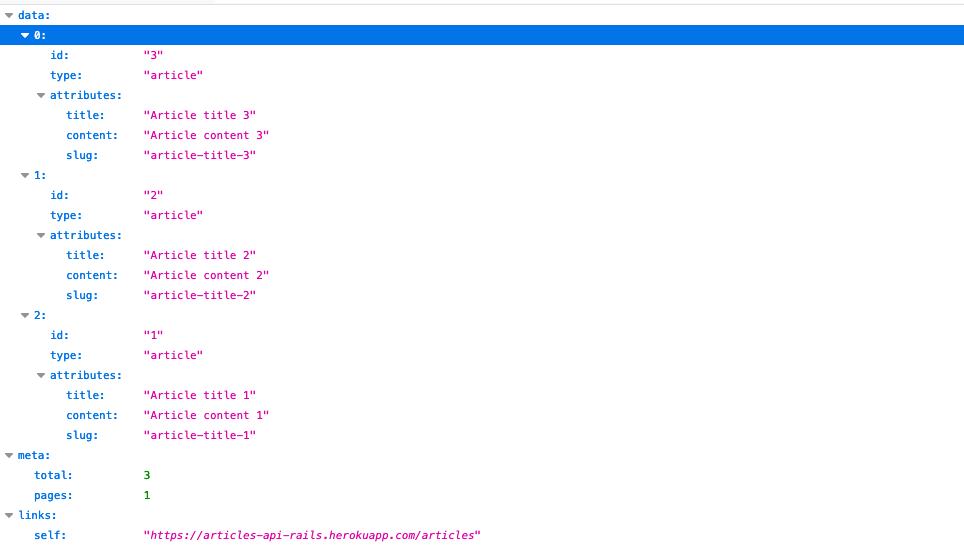

# Ariticles API

> An API made with [Ruby on Rails](https://rubyonrails.org/).

    

This project consisted on building an API to make all the CRUD with ariticles and comments for those articles.

## Built With

- [Ruby on Rails](https://rubyonrails.org/)

## Live Demo

[https://articles-api-rails.herokuapp.com/articles](https://articles-api-rails.herokuapp.com/articles)

## Getting Started

To get a local copy up and running follow these simple example steps.

### Prerequisites

Make sure you have installed [Ruby 2.7.2](https://www.ruby-lang.org/en/news/2020/10/02/ruby-2-7-2-released/). [RVM](https://rvm.io/) manager could be useful to achieve this.

### Setup

Download the project

    $ git clone https://github.com/fivan18/articles-rails-api.git

Install the dependencies

    $ bundle

### Run the server

    $ rails s

### Usage

You can fetch the articles with the next URL: [http://localhost:3000/articles](http://localhost:3000/articles).

### Run tests

    $ rspec

### Deployment

This project was deployed on [Heroku](https://heroku.com/). Follow [this](hhttps://devcenter.heroku.com/articles/getting-started-with-rails6) instructions to deploy the app.

## Authors

👤 **Ivan Ulises Guzman Sanchez**

- Github: [@fivan18](https://github.com/fivan18)
- Twitter: [@fivanunam](https://twitter.com/fivanunam)
- Linkedin: [fivan](https://www.linkedin.com/in/fivan)

## Contributing

Contributions, issues and feature requests are welcome!

Feel free to check the [issues page](https://github.com/fivan18/articles-rails-api/issues).

## Show your support

Give a ⭐️ if you like this project!
